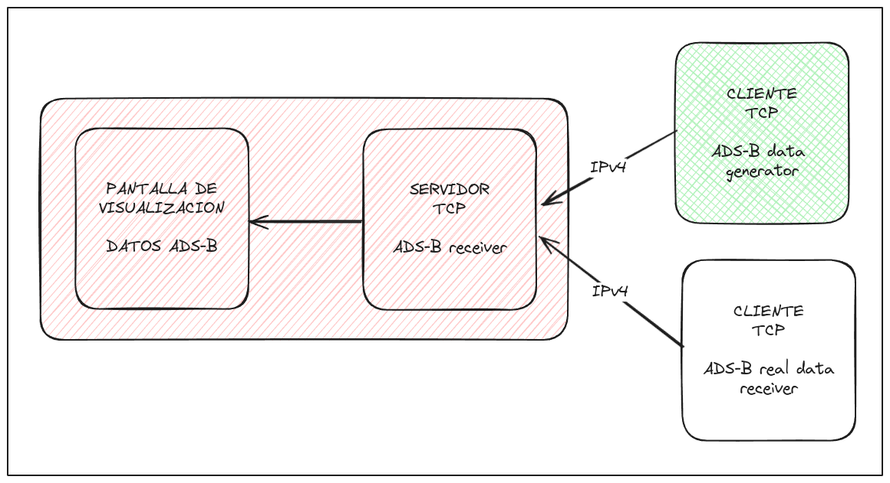

# ADS-B Visual
Visualization of ADS-B data

## General Sketch

## Related to
- [HTTP API for ADS-B data](https://api.adsb.lol/)
- [ADS-B message format](https://mode-s.org/decode/content/ads-b/1-basics.html)
- [Nautical Mile](https://en.wikipedia.org/wiki/Nautical_mile)
- [Wiki SDL2](https://wiki.libsdl.org/SDL2)

## LICENSE
[MIT](https://choosealicense.com/licenses/mit/)
